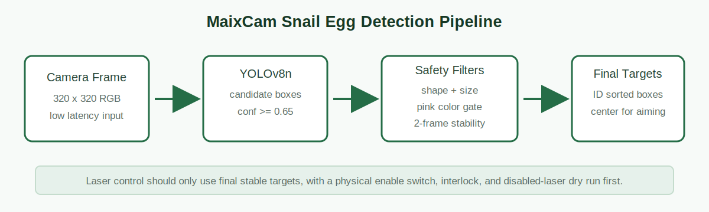
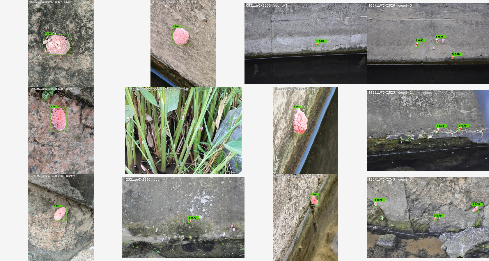
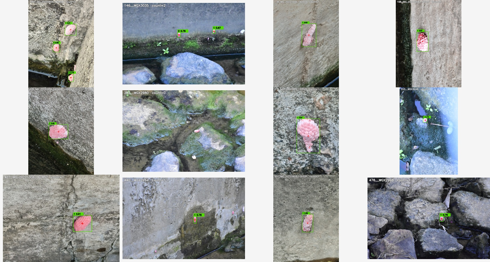
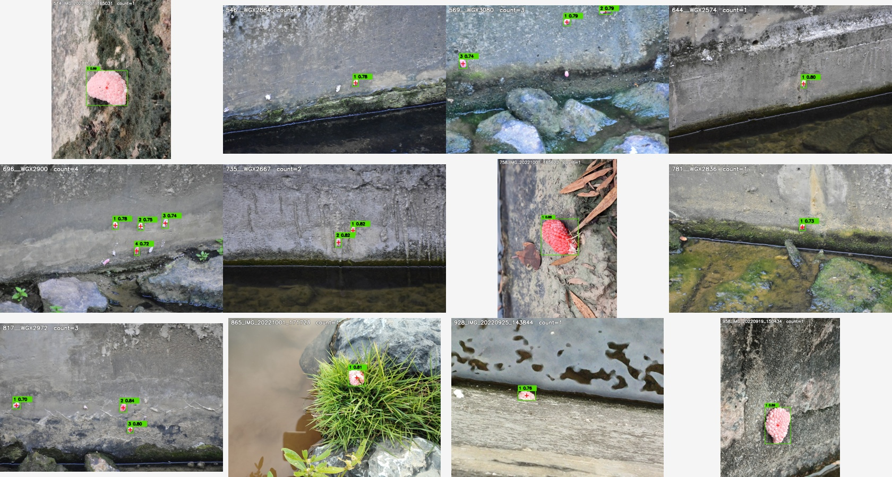

# MaixCam 福寿螺卵实时识别

这个仓库用于在 Sipeed MaixCam 上实时识别福寿螺卵团，并在 640x480 摄像头画面中标出紧贴目标的框、中心十字和从左上到右下排序的 ID。当前默认版本是 640x480 YOLOv8n 单次全画面推理，不使用 tile 轮询和短时记忆框，适合后续做低延迟瞄准验证。

> 安全提醒：本项目只输出视觉候选目标和坐标。任何激光、机械臂、喷洒或消杀执行器都必须加入物理使能、急停、遮光/门禁联锁、低功率预瞄准验证和人工确认流程。首次调试请断开激光，或用低功率指示灯替代。



## 当前版本

| 项目 | 当前值 |
| --- | --- |
| 设备 | Sipeed MaixCam / MaixPy |
| 模型 | YOLOv8n |
| 输入 | 640x480 |
| 运行方式 | 单次全画面推理 |
| 模型文件 | `snail_eggs_yolov8n_640x480.cvimodel` + `snail_eggs_yolov8n_640x480.mud` |
| 程序文件 | `release/maixcam_copy_to_device/main.py` |
| 开机自启 | 写入 `/maixapp/auto_start.txt` |

关键设备端参数在 [maixcam/main.py](maixcam/main.py) 顶部：

```python
MODEL = "/root/models/snail_eggs_yolov8n_640x480.mud"
CONF_TH = 0.25
MIN_MODEL_CONF = 0.25
SPEED_PROFILE = "full_frame"
FRAME_W = 640
FRAME_H = 480
USE_TILED_INFERENCE = False
```

`full_frame` 模式每一帧只跑一次 640x480 模型，不使用上一轮 tile 的记忆目标，因此不会出现固定位置不断残留旧框的问题。

## 验收指标

当前上线权重：

```text
runs/detect/runs_yolo/pinkeggs_yolov8n_640x480_hardneg_v5/weights/best.pt
```

导出的 MaixCam 文件：

```text
release/maixcam_copy_to_device/root/models/snail_eggs_yolov8n_640x480.cvimodel
release/maixcam_copy_to_device/root/models/snail_eggs_yolov8n_640x480.mud
```

离线评估结果：

| 评估项 | 设置 | 结果 |
| --- | --- | --- |
| YOLO test split | `imgsz=480,640`，`conf=0.25`，带安全过滤 | TP 87 / FP 4 / FN 8，Recall 91.58%，Precision 95.60% |
| YOLO test split | `imgsz=480,640`，`conf=0.15`，带安全过滤 | TP 88 / FP 6 / FN 7，Recall 92.63%，Precision 93.62% |
| COCO 负样本 holdout | 3700 张未进入训练的 COCO 图，`conf=0.25`，带安全过滤 | 2 张图出现误检，图像级误检率 0.054% |
| COCO 负样本 holdout | 3700 张未进入训练的 COCO 图，`conf=0.35`，带安全过滤 | 1 张图出现误检，图像级误检率 0.027% |

当前设备端默认采用 `conf=0.25`。如果要接执行器，可以先把 `CONF_TH` 和 `MIN_MODEL_CONF` 提到 `0.35` 做低功率验证，再按现场召回需求逐步调低。

效果示例：





## 仓库结构

```text
assets/                         说明图和检测示例
docs/                           VSCode + SSH 工作流说明
maixcam/                        MaixCam 实时检测程序和 MUD 模板
models/                         PC 端训练/导出模型
release/maixcam_copy_to_device/ 可直接复制到 MaixCam 的部署包
scripts/                        采集、训练、评估、转换、部署脚本
requirements.txt                PC/Mac 端 Python 依赖
```

本地大数据和训练输出默认不进入 Git：`data/`、`runs/`、`dist/`、`*.cache`、临时导出的权重等。

## Mac 学生快速部署

学生不需要重新训练模型，只要把 release 包复制到 MaixCam。

1. MaixCam 连上同一个网络，确认 IP，例如 `192.168.10.107`。
2. 在 Mac 终端进入仓库目录。
3. 上传程序和模型：

```bash
MAIX_IP=192.168.10.107
APP_ID=cdh1_

ssh root@$MAIX_IP "mkdir -p /maixapp/apps/$APP_ID /root/models"
scp release/maixcam_copy_to_device/main.py root@$MAIX_IP:/maixapp/apps/$APP_ID/main.py
scp release/maixcam_copy_to_device/root/models/snail_eggs_yolov8n_640x480.* root@$MAIX_IP:/root/models/
ssh root@$MAIX_IP "echo $APP_ID > /maixapp/auto_start.txt && sync && reboot"
```

4. 重启后确认：

```bash
ssh root@$MAIX_IP "cat /maixapp/auto_start.txt && ps | grep main.py"
```

看到 `python3 /maixapp/apps/cdh1_/main.py auto_start` 就说明开机自启已生效。

## Windows 自动部署

仓库里带了基于 SSH 的部署脚本。先安装依赖：

```powershell
python -m venv .venv
.\.venv\Scripts\Activate.ps1
pip install -r requirements.txt
```

设置设备地址并部署：

```powershell
$env:MAIXCAM_HOST='192.168.10.107'
$env:MAIXCAM_PASSWORD='root'
powershell -NoProfile -ExecutionPolicy Bypass -File scripts\maix_remote.ps1 install-autostart --app-id cdh1_ --reboot
```

这条命令会上传 `main.py` 和 release 里的模型文件，写入 `/maixapp/auto_start.txt`，然后重启设备。

更多细节见 [docs/vscode_maixcam_workflow.md](docs/vscode_maixcam_workflow.md)。

## PC/Mac 图片和视频检测

安装依赖：

```bash
python3 -m venv .venv
source .venv/bin/activate
pip install -r requirements.txt
```

检测图片：

```bash
python scripts/yolo_detect_media.py path/to/image.jpg \
  --model models/snail_eggs_yolov8n_640x480.pt \
  --conf 0.25 \
  --safe-filter
```

检测视频：

```bash
python scripts/yolo_detect_media.py path/to/video.mp4 \
  --model models/snail_eggs_yolov8n_640x480.pt \
  --conf 0.25 \
  --safe-filter \
  --video-stride 1
```

输出默认保存到 `runs/yolo_media/`，包括标注图片/视频和 JSON 坐标。

## 复现训练

训练数据不直接提交到 Git。复现时需要准备正样本和负样本。

1. 收集正样本并导出 YOLO 标签：

```bash
python scripts/collect_pinkeggs_dataset.py --source full --limit 500 --output-dir data/pinkeggs_full_500
python scripts/export_yolo_labels.py --dataset data/pinkeggs_full_500/annotations.json --output-dir data/yolo_pinkeggs_clean_500 --clean
```

2. 准备生活场景负样本。推荐 COCO val2017，也可以加入自己拍摄的红色电机、线材、贴纸、手套、玩具、反光物等干扰物：

```bash
mkdir -p data/coco
curl -L --fail --retry 3 -o data/coco/val2017.zip http://images.cocodataset.org/zips/val2017.zip
unzip -o data/coco/val2017.zip -d data/coco
```

3. 构建 hard-negative 数据集：

```bash
python scripts/build_hard_negative_yolo.py \
  --positive-root data/yolo_pinkeggs_clean_500 \
  --negative-dir data/coco/val2017 \
  --output-dir data/yolo_pinkeggs_hardneg_v2 \
  --clean \
  --seed 20260529

python scripts/augment_yolo_snail_data.py \
  --data-root data/yolo_pinkeggs_hardneg_v2 \
  --train-montage 220 \
  --train-negatives 360 \
  --val-montage 30 \
  --val-negatives 70 \
  --seed 20260529
```

4. 先训练 320 基线模型：

```bash
python scripts/yolo_train.py \
  --data data/yolo_pinkeggs_hardneg_v2/pinkeggs_hardneg.yaml \
  --base-model yolov8n.pt \
  --epochs 70 \
  --imgsz 320 \
  --batch 32 \
  --device 0 \
  --workers 0 \
  --project runs_yolo \
  --name pinkeggs_yolov8n_hardneg_v2 \
  --patience 16 \
  --export-onnx
```

5. 用 320 基线挖 640x480 难负样本：

```bash
python scripts/mine_false_positives.py \
  --model runs/detect/runs_yolo/pinkeggs_yolov8n_hardneg_v2/weights/best.pt \
  --base-data-root data/yolo_pinkeggs_hardneg_v2 \
  --output-data-root data/yolo_pinkeggs_hardneg_v5_640x480 \
  --negative-dir data/coco/val2017 \
  --imgsz 480,640 \
  --conf 0.05 \
  --device 0 \
  --max-full-images 1400 \
  --max-crops 2200 \
  --clean
```

6. 训练当前 640x480 上线模型：

```bash
python scripts/yolo_train.py \
  --data data/yolo_pinkeggs_hardneg_v5_640x480/pinkeggs_hardneg.yaml \
  --base-model runs/detect/runs_yolo/pinkeggs_yolov8n_hardneg_v2/weights/best.pt \
  --epochs 35 \
  --imgsz 640 \
  --export-imgsz 480,640 \
  --batch 12 \
  --device 0 \
  --workers 0 \
  --project runs_yolo \
  --name pinkeggs_yolov8n_640x480_hardneg_v5 \
  --patience 10 \
  --export-onnx
```

`--imgsz 640` 用于训练增强，`--export-imgsz 480,640` 用于导出固定 640x480 ONNX，匹配 MaixCam 摄像头画面。

## 评估命令

阈值扫描：

```bash
python scripts/evaluate_thresholds.py \
  --model runs/detect/runs_yolo/pinkeggs_yolov8n_640x480_hardneg_v5/weights/best.pt \
  --data-root data/yolo_pinkeggs_hardneg_v5_640x480 \
  --split test \
  --imgsz 480,640 \
  --safe-filter \
  --confs 0.15,0.20,0.25,0.30,0.35,0.40,0.50 \
  --output runs/eval_640x480_v5_safe.json
```

独立负样本误检率：

```bash
python scripts/evaluate_negative_fps.py \
  --model runs/detect/runs_yolo/pinkeggs_yolov8n_640x480_hardneg_v5/weights/best.pt \
  --negative-dir data/coco/val2017 \
  --imgsz 480,640 \
  --conf 0.25 \
  --safe-filter \
  --exclude-yolo-root data/yolo_pinkeggs_hardneg_v5_640x480 \
  --output runs/eval_640x480_v5_coco_holdout_conf025.json
```

## 转换到 MaixCam

MaixCam 不能直接运行 `.pt` 或普通 `.onnx`。转换链路是：

```text
YOLO .pt -> ONNX .onnx -> MaixCam .cvimodel + .mud
```

准备转换目录：

```bash
cp runs/detect/runs_yolo/pinkeggs_yolov8n_640x480_hardneg_v5/weights/best.pt models/snail_eggs_yolov8n_640x480.pt
cp runs/detect/runs_yolo/pinkeggs_yolov8n_640x480_hardneg_v5/weights/best.onnx models/snail_eggs_yolov8n_640x480.onnx

python scripts/prepare_maixcam_package.py \
  --model-name snail_eggs_yolov8n_640x480 \
  --onnx models/snail_eggs_yolov8n_640x480.onnx \
  --mud maixcam/snail_eggs_yolov8n_640x480.mud \
  --input-width 640 \
  --input-height 480 \
  --calibration-images 200
```

在 TPU-MLIR 环境中转换：

```bash
VALIDATE_TRANSFORM=0 bash scripts/wsl_convert_maixcam_snail_eggs.sh
```

成功后会更新：

```text
release/maixcam_copy_to_device/main.py
release/maixcam_copy_to_device/root/models/snail_eggs_yolov8n_640x480.cvimodel
release/maixcam_copy_to_device/root/models/snail_eggs_yolov8n_640x480.mud
release/maixcam_copy_to_device.zip
```

## 坐标输出

状态行：

```text
STAT,<frame>,FPS,<fps>,RAW,<raw_count>,CAND,<candidate_count>,EGGS,<target_count>,TILE,<tile_info>
```

目标行：

```text
EGG,<id>,<cx>,<cy>,<x>,<y>,<w>,<h>,<score>,<cx_norm>,<cy_norm>
```

`id` 是从左上到右下排序后的编号；`cx/cy` 是检测框中心像素坐标；`cx_norm/cy_norm` 是 0 到 1 的归一化中心点。

## 现场继续提升

最有效的提升方式是补真实现场数据：

1. 用最终安装角度的 MaixCam 拍摄真实场景。
2. 把漏检的卵团重新标注后加入正样本。
3. 把红色电机、线材、贴纸、手套、粉色玩具、反光物等误检对象加入负样本。
4. 重新训练、评估、转换、部署。
5. 接入执行器前，先用低功率指示灯验证坐标稳定性。

## 参考资料

- [Sipeed MaixPy](https://github.com/sipeed/maixpy)
- [MaixPy 自定义 YOLOv8 模型文档](https://wiki.sipeed.com/maixpy/doc/zh/vision/customize_model_yolov8.html)
- [MaixCam ONNX 转 MUD 文档](https://wiki.sipeed.com/maixpy/doc/zh/ai_model_converter/maixcam.html)
- [Ultralytics YOLO 文档](https://docs.ultralytics.com/)
- [Pink-Eggs Dataset V1](https://datasetninja.com/pink-eggs-dataset-v1)
