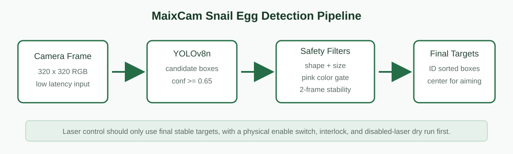

# MaixCam 福寿螺卵实时识别与云台跟踪

基于 YOLOv8n、MaixPy 和 Sipeed MaixCam 的边缘视觉项目。当前发布版以
`640x480` 全画面单次推理检测福寿螺卵团，在设备屏幕实时绘制紧框、中心点和
从左上到右下排列的 ID，并可在明确使能后驱动二轴云台稳定跟踪一团目标。

> 安全边界：程序只自动控制低功率红色瞄准灯和舵机云台。高功率激光必须保持
> 人工控制，并配置物理使能、急停、遮光和人员确认。首次调试请断开高功率激光。

## 当前发布版

| 项目 | 配置 |
| --- | --- |
| 设备 | Sipeed MaixCam / MaixPy |
| 检测模型 | YOLOv8n，单类别 `eggs` |
| 摄像头与模型输入 | `640x480` |
| 推理方式 | 全画面单次推理，不使用逐帧切片 |
| 默认模型阈值 | `0.20`，再经过颜色、尺寸和形状安全过滤 |
| 多目标显示 | 全部目标标框，按左上到右下显示 ID |
| 主目标策略 | 优先锁定面积较大、置信度高、靠近画面中心且不贴边的目标 |
| 云台范围 | 水平 `60–120°`，俯仰 `80–120°`，中心均为 `90°` |
| 云台接线 | A18/PWM6 水平，A19/PWM7 俯仰 |
| 红色瞄准灯 | A15/GPIOA15；开启按键脉冲两次，关闭一次 |
| 瞄准反馈 | 相机内检测低功率红点，闭环移动到锁定框内；固定点仅作降级参考 |
| 参考实测 | 正常显示约 `5.35 FPS`；红点末 20 次平均归一化误差 `0.0015 / 0.0145` |

`maixcam/main.py` 是设备程序的唯一源码基线。以下发布目录是它的可部署镜像：

```text
release/maixcam_copy_to_device/
release/maixcam_copy_to_device.zip
```

## 功能概览

- 640x480 实时 YOLO 检测，避免切片轮询造成旧框和延迟。
- 模型分数、粉色比例、红色排除、尺寸和形状联合过滤。
- 多目标卡尔曼状态估计、稳定帧确认、短时漏检保轨和重复框合并。
- 跟踪期间不因相邻卵团瞬时出现而切换目标；原目标连续约 5 秒无法恢复时切换下一团。
- 云台 10 Hz 限速控制，包含死区软化、速度、加速度和机械角度限幅。
- 低功率红点 RGB 峰值检测、闭环瞄准和锁定框内九点扫描。
- 瞄准灯启动状态同步、短时漏检保持和长时间失锁关闭；高功率执行器不在代码控制范围内。
- 运行时标志文件可启用、干跑或紧急禁用云台，不必修改代码。
- Windows、macOS 和 Linux 均可通过 SSH 部署。



[查看 MaixCam 红点闭环与框内扫描实机演示](assets/demos/closed_loop_scan_demo.mp4)

## 快速体验

### PC / Mac 图片与视频

要求 Python 3.10 或更高版本。

```bash
python3 -m venv .venv
source .venv/bin/activate       # Windows: .venv\Scripts\activate
pip install -r requirements.txt
```

检测图片：

```bash
python scripts/yolo_detect_media.py path/to/image.jpg \
  --model models/snail_eggs_yolov8n_640x480.pt \
  --conf 0.20 --safe-filter
```

检测视频：

```bash
python scripts/yolo_detect_media.py path/to/video.mp4 \
  --model models/snail_eggs_yolov8n_640x480.pt \
  --conf 0.20 --safe-filter --video-stride 1
```

结果保存在 `runs/yolo_media/`。该目录默认不提交 Git。

### MaixCam 一键临时运行

先在 MaixCam 的系统设置中连接 Wi-Fi 并开启 SSH，确认电脑和设备处于同一局域网。
默认 SSH 用户和密码均为 `root`。

Windows PowerShell：

```powershell
$env:MAIXCAM_HOST='192.168.x.x'
$env:MAIXCAM_PASSWORD='root'
python scripts\maix_remote.py probe
python scripts\maix_remote.py deploy-run
```

macOS / Linux：

```bash
export MAIXCAM_HOST=192.168.x.x
export MAIXCAM_PASSWORD=root
python3 scripts/maix_remote.py probe
python3 scripts/maix_remote.py deploy-run
```

`deploy-run` 会上传代码和模型并在 SSH 会话中运行，适合首次验收。按 `Ctrl+C`
停止，不会设置开机自启。

## 正式部署与自启动

推荐给应用使用有意义的 ID，例如 `snail_egg`。它只是 `/maixapp/apps/` 下的目录名，
不是固定名称，也不必写成 `cdh1_`。

```powershell
python scripts\maix_remote.py install-autostart --app-id snail_egg --reboot
```

只更新程序、不重复上传模型：

```powershell
python scripts\maix_remote.py install-autostart --app-id snail_egg --skip-models --reboot
```

部署后的关键路径：

```text
/maixapp/apps/snail_egg/main.py
/root/models/snail_eggs_yolov8n_640x480.mud
/root/models/snail_eggs_yolov8n_640x480.cvimodel
/maixapp/auto_start.txt
```

也可以直接复制 `release/maixcam_copy_to_device.zip` 中的文件。完整有线和 SSH
说明见 [MaixCam SSH 远程控制](docs/ssh_remote_control_maixcam.md) 与
[VSCode 工作流](docs/vscode_maixcam_workflow.md)。

## 云台与瞄准灯

### 接线

| 功能 | MaixCam 引脚 | 程序接口 |
| --- | --- | --- |
| 水平舵机 | A18 | PWM6 |
| 俯仰舵机 | A19 | PWM7 |
| 红色瞄准灯继电器 | A15 | GPIOA15 |

舵机必须使用容量足够的独立 5 V 稳压电源，并与 MaixCam 共地。不要直接由
MaixCam 的 3.3 V 引脚给舵机供电。

### 分级启用

发布版默认不输出舵机 PWM。先启用干跑，只观察控制日志：

```bash
ssh root@192.168.x.x '
  mkdir -p /root/snail_egg &&
  touch /root/snail_egg/enable_gimbal_tracking /root/snail_egg/gimbal_dry_run
'
```

确认目标锁定、方向和限幅后再启用真实云台：

```bash
ssh root@192.168.x.x '
  rm -f /root/snail_egg/gimbal_dry_run /root/snail_egg/disable_gimbal &&
  touch /root/snail_egg/enable_gimbal_tracking /root/snail_egg/enable_closed_loop_aim
'
```

中心闭环稳定后，启用低功率红点在锁定框内扫描：

```bash
ssh root@192.168.x.x '
  touch /root/snail_egg/enable_aim_scan
'
```

关闭框内扫描但保留中心闭环：

```bash
rm -f /root/snail_egg/enable_aim_scan
```

紧急禁用：

```bash
ssh root@192.168.x.x '
  touch /root/snail_egg/disable_gimbal &&
  rm -f /root/snail_egg/enable_gimbal_tracking /root/snail_egg/gimbal_dry_run \
        /root/snail_egg/enable_closed_loop_aim /root/snail_egg/enable_aim_scan
'
```

屏幕近距离测试与室外 1 m 工作距离是不同标定。仅在约 0.35 m 的显示器测试时
创建 `/root/snail_egg/screen_tracking_test`；室外运行前必须删除它。

禁用红色瞄准灯继电器：

```bash
touch /root/snail_egg/disable_aim_relay
```

程序每次启动先按一次按钮同步到关闭状态；检测稳定目标后按两次开启。首次启动测试
完成标志为 `/root/snail_egg/aim_relay_startup_test_done`。删除该文件后，下次启动会在
状态同步后额外执行一次 1 秒红色瞄准灯开关测试。

更完整的控制方法和验收标准见：

- [云台跟踪设计](docs/gimbal_tracking_design.md)
- [云台动态测试流程](docs/gimbal_tracking_test_protocol.md)

## 运行状态与坐标

设备终端周期输出：

```text
STAT,<frame>,FPS,<fps>,RAW,<raw_count>,CAND,<candidate_count>,EGGS,<target_count>,TILE,<tile_info>
EGG,<id>,<cx>,<cy>,<x>,<y>,<w>,<h>,<score>,<cx_norm>,<cy_norm>
DOT,<x>,<y>,SCORE,<score>,FRESH,<0|1>,MISSES,<count>
AIM,TRACK,<lock_id>,EX,<x_error>,EY,<y_error>,PAN,<offset>,TILT,<offset>,REF,<dot_x>,<dot_y>,DES,<aim_x>,<aim_y>,RAWID,<track_id>
```

其中 `id` 是当前帧左上到右下的显示编号；`cx/cy` 是像素中心；
`cx_norm/cy_norm` 是 0 到 1 的归一化中心坐标。

关键主机回归测试：

```bash
python scripts/test_closed_loop_aim.py
python scripts/test_target_lock_persistence.py
python scripts/test_gimbal_control_dynamics.py
```

## 训练复现

大型训练集和 `runs/` 不纳入 Git。数据需按 YOLO 单类别检测格式准备：

```text
data/<dataset>/
  images/train  images/val  images/test
  labels/train  labels/val  labels/test
  dataset.yaml
```

训练并导出固定 `640x480` ONNX：

```bash
python scripts/yolo_train.py \
  --data data/<dataset>/dataset.yaml \
  --base-model yolov8n.pt \
  --epochs 80 --imgsz 640 --export-imgsz 480,640 \
  --batch 16 --device 0 --workers 0 \
  --project runs_yolo --name snail_eggs_640x480 \
  --patience 15 --rect --export-onnx
```

阈值和召回评估：

```bash
python scripts/evaluate_thresholds.py \
  --model runs_yolo/snail_eggs_640x480/weights/best.pt \
  --data-root data/<dataset> --split test --imgsz 480,640 \
  --safe-filter --confs 0.10,0.15,0.20,0.25,0.30,0.35,0.40 \
  --output runs/eval_thresholds.json
```

硬负样本误检评估：

```bash
python scripts/evaluate_negative_fps.py \
  --model runs_yolo/snail_eggs_640x480/weights/best.pt \
  --negative-dir data/hard_negatives_mixed \
  --imgsz 480,640 --conf 0.20 --safe-filter \
  --output runs/eval_negative.json
```

生成 MaixCam 转换包：

```bash
python scripts/prepare_maixcam_package.py \
  --model-name snail_eggs_yolov8n_640x480 \
  --onnx models/snail_eggs_yolov8n_640x480.onnx \
  --mud maixcam/snail_eggs_yolov8n_640x480.mud \
  --input-width 640 --input-height 480 \
  --calibration-dir data/<dataset>/images/train \
  --calibration-images 200

VALIDATE_TRANSFORM=0 bash scripts/wsl_convert_maixcam_snail_eggs.sh
```

转换流程需要 WSL/Linux 和 TPU-MLIR。模型更新后必须重新执行正样本召回、硬负样本、
多目标、真机光照/距离变化和云台动态测试，不能只看训练集指标。

## 仓库结构

```text
assets/                         文档图片和结果示例
docs/                           部署、跟踪设计和测试方法
maixcam/                        MaixCam 程序源码
models/                         PC 权重和 ONNX
release/maixcam_copy_to_device/ 可直接复制到设备的发布镜像
scripts/                        训练、评估、转换、部署和测试工具
```

以下本地内容默认不提交：`data/`、`runs/`、`runs_yolo/`、`dist/`、
`outputs/` 和测试视频。

## 参考资料

- [Sipeed MaixCam](https://wiki.sipeed.com/hardware/zh/maixcam/index.html)
- [MaixPy 文档](https://wiki.sipeed.com/maixpy/)
- [MaixPy 自定义 YOLOv8](https://wiki.sipeed.com/maixpy/doc/zh/vision/customize_model_yolov8.html)
- [MaixCam ONNX 转 MUD](https://wiki.sipeed.com/maixpy/doc/zh/ai_model_converter/maixcam.html)
- [Ultralytics YOLO](https://docs.ultralytics.com/)
- [Pink-Eggs Dataset V1](https://datasetninja.com/pink-eggs-dataset-v1)
