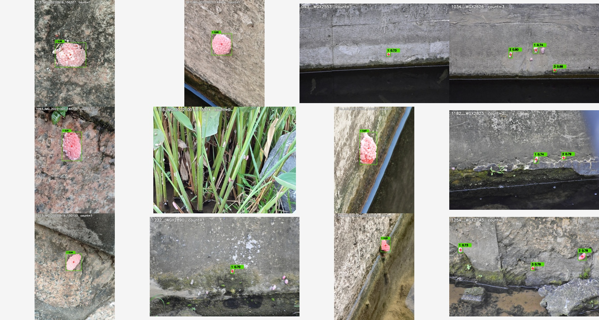
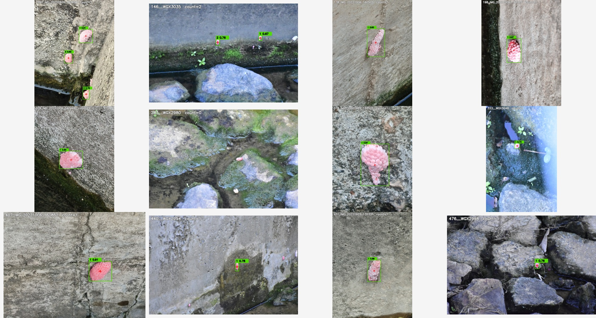
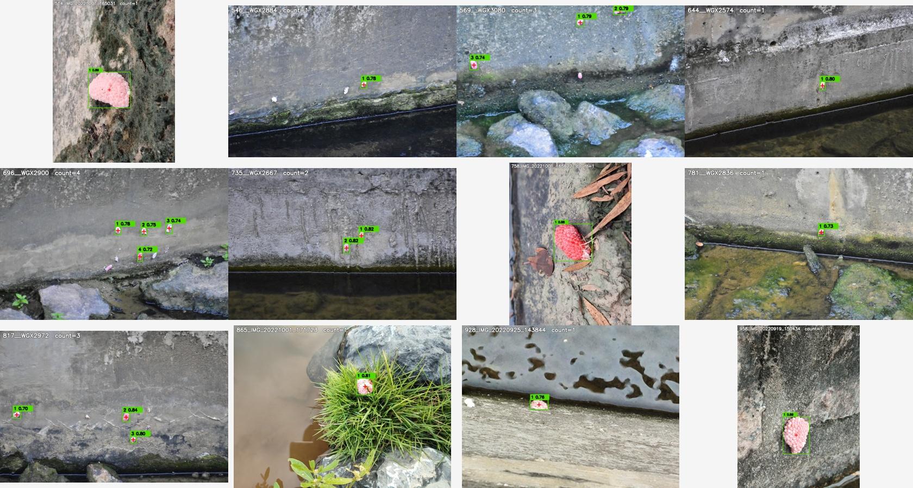

# MaixCam 福寿螺卵实时识别

## 多目标小目标优化（v12）

本版针对“单团准确、同屏多团漏检”重新训练。数据严格按
`train/val/test` 分源，测试图片不参与训练；新增 2--6 团多实例场景、
18--82 px 尺度分层、亮度/对比度变化和真实硬负背景，并保留上下文中
每一团可辨卵的标签。

独立 PC 验收（640 输入，置信度 0.38）：

- 原始 test：mAP50 97.45%，mAP50-95 62.75%。
- 多目标可辨尺度验证集：实例召回率 90.1%。
- 800 张独立硬负图片：颜色安全过滤后出现 2 个点状误检；部署端额外
  排除双边均不超过 11 px 的不可操作点状框。
- MaixCam 单次 640x480 推理约 20 FPS；未启用会显著降速的逐帧 SAHI。

多目标云台跟踪采用安全的连续中心锁：首次选择最左列上方目标，之后只
接受距上一帧中心 40 px 内的新检测。短时漏检时进入 `HOLD`，不会改锁
旁边的卵团。舵机命令仍由运行时使能文件控制，并硬限制在中心 ±45°。

复现多目标数据和评估：

```bash
python scripts/build_multi_instance_dataset.py \
  --base data/yolo_pinkeggs_camera_domain_v10_640x480 \
  --source data/yolo_pinkeggs_hardneg_v8_field_light_640x480 \
  --output data/yolo_pinkeggs_multi_v12_640x480 \
  --train-scenes 1400 --val-scenes 240 --clean

python scripts/evaluate_multi_instance.py \
  --model models/snail_eggs_yolov8n_640x480.pt \
  --dataset data/yolo_pinkeggs_multi_v12_640x480 \
  --conf 0.38 --output runs/multi_instance_report.json
```

基于 YOLOv8n 和 Sipeed MaixCam 的福寿螺卵团实时检测程序。项目默认使用 640x480 摄像头画面做全画面单次推理，在屏幕上标出紧贴目标的检测框、中心十字和从左上到右下排序的 ID。

当前版本面向低延迟瞄准验证：不使用 tile 轮询，不保留旧帧记忆框，避免同一位置反复残留识别框。

> 安全提醒：本项目只输出视觉候选目标和坐标。任何激光、机械臂、喷洒或消杀执行器都必须加入物理使能、急停、遮光/门禁联锁、低功率预瞄准验证和人工确认流程。首次调试请断开激光，或用低功率指示灯替代。

## 二轴云台跟踪

当前版本已经加入轻量的云台跟踪控制器，设计说明见 [docs/gimbal_tracking_design.md](docs/gimbal_tracking_design.md)。默认配置不会初始化 PWM，也不会让舵机动作：

```python
ENABLE_GIMBAL = False
ENABLE_GIMBAL_TRACKING = False
```

开启真实舵机跟踪前，必须只连接安全的舵机负载，并确认当前实测接线为水平 A18/PWM6、俯仰 A19/PWM7。控制器包含稳定帧门槛、当前帧检测门槛、10 Hz 更新、误差低通、角速度/角加速度限制、单次变化限制和 45° 绝对偏移限幅。预测框只用于保持画面和 ID 连续，不会驱动舵机。紧急禁用可以在设备上创建：

```text
/root/snail_egg/disable_gimbal
```

当前激光发生器位于摄像头右侧 `10 mm`、下方 `60 mm`，只要求约 `1.0 m` 工作距离。按 GC4653 原装镜头水平 `81°`、垂直 `51°` 视场计算，固定瞄准点是画面 `(324,270)`，不是几何中心 `(320,240)`。生产控制直接使用这个固定点，不识别红点；改变距离、镜头、分辨率或安装位置后必须重新标定。

近距离屏幕调试约为 `0.35 m`，`screen_tracking_test` 模式使用实测点 `(329,326)` 和 `0.08` 检测阈值；同时排除该点 `32 px` 内尺寸不超过 `52x56 px` 的小亮斑框，防止模型反过来锁住激光红点。删除测试标志后自动恢复 1 m 参数。

可重复的屏幕目标程序和调试方法见 [云台跟踪测试方法](docs/gimbal_tracking_test_protocol.md)。程序默认是置顶的桌面小窗，不会占满屏幕；它会直接读取 PPTX 内的图片，依次运行居中、水平、垂直、矩形和平滑随机轨迹，并把目标位置写入 CSV：

```powershell
python scripts\gimbal_target_runner.py --pptx "path\to\images.pptx" --mode sequence --model models\snail_eggs_yolov8n_640x480.pt
```

右键或 `Esc` 可关闭小窗。`--fullscreen` 只用于无人值守实验，不是默认行为。


## 效果示例







## 当前版本

| 项目 | 当前值 |
| --- | --- |
| 设备 | Sipeed MaixCam / MaixPy |
| 模型 | YOLOv8n |
| 输入 | 640x480 |
| 推理方式 | 全画面单次推理 |
| MaixCam 模型 | `snail_eggs_yolov8n_640x480.cvimodel` + `snail_eggs_yolov8n_640x480.mud` |
| 默认程序 | `release/maixcam_copy_to_device/main.py` |
| 开机自启 | 写入 `/maixapp/auto_start.txt` |

关键参数在 [maixcam/main.py](maixcam/main.py) 顶部：

```python
MODEL = "/root/models/snail_eggs_yolov8n_640x480.mud"
CONF_TH = 0.38
MIN_MODEL_CONF = 0.38
MAX_BOX_AREA_RATIO = 0.32
MAX_BOX_SIDE_RATIO = 0.86
MIN_PINK_RATIO = 0.035
SPEED_PROFILE = "full_frame"
FRAME_W = 640
FRAME_H = 480
USE_TILED_INFERENCE = False
```

`CONF_TH=0.38` 是 v10 INT8 模型在当前 MaixCam 上经过正负动态验收后的设置。更换镜头、光照环境或安装距离后必须重新跑正样本召回和困难负样本测试，不应只靠降低阈值补召回。

## 离线评估

当前上线权重：

```text
runs/detect/runs_yolo/pinkeggs_camera_domain_v10_v8n/weights/best.pt
```

对应的可发布文件已经放在：

```text
models/snail_eggs_yolov8n_640x480.pt
models/snail_eggs_yolov8n_640x480.onnx
release/maixcam_copy_to_device/root/models/snail_eggs_yolov8n_640x480.cvimodel
release/maixcam_copy_to_device/root/models/snail_eggs_yolov8n_640x480.mud
```

| 评估项 | 设置 | 结果 |
| --- | --- | --- |
| 原始 YOLO test split | 216 张，95 个实例 | Precision 94.7%，Recall 93.3%，mAP50 97.0% |
| 真机 PPT 留出集 | 27 帧，未参与训练，PC `conf=0.40` | 25/27 帧检出，帧召回 92.6% |
| 真机动态正样本 | 正常、暗淡、缩小和移动，INT8 `conf=0.38` | 可见统计窗口全部保持检测；约 16.5 FPS |
| 真机动态困难负样本 | 40 类干扰图，INT8 `conf=0.38` | 64/64 统计窗口零误报；约 19.1 FPS |

评估结果保存在：

```text
runs/eval_640x480_v5_revised_filter.json
runs/eval_640x480_v5_revised_neg_conf018.json
```

`runs/` 默认不提交到 Git；如果需要复核，请在本地重新运行评估脚本。

## 快速部署到 MaixCam

仓库已经包含可直接复制到设备的部署包：

```text
release/maixcam_copy_to_device/
release/maixcam_copy_to_device.zip
```

Mac / Linux 终端示例：

```bash
MAIX_IP=192.168.10.107
APP_ID=cdh1_

ssh root@$MAIX_IP "mkdir -p /maixapp/apps/$APP_ID /root/models"
scp release/maixcam_copy_to_device/main.py root@$MAIX_IP:/maixapp/apps/$APP_ID/main.py
scp release/maixcam_copy_to_device/root/models/snail_eggs_yolov8n_640x480.* root@$MAIX_IP:/root/models/
ssh root@$MAIX_IP "echo $APP_ID > /maixapp/auto_start.txt && sync && reboot"
```

重启后检查：

```bash
ssh root@$MAIX_IP "cat /maixapp/auto_start.txt && ps | grep main.py"
```

看到类似下面的进程即部署成功：

```text
python3 /maixapp/apps/cdh1_/main.py auto_start
```

## Windows / VSCode 自动部署

安装依赖：

```powershell
python -m venv .venv
.\.venv\Scripts\Activate.ps1
pip install -r requirements.txt
```

设置设备地址并部署：

```powershell
$env:MAIXCAM_HOST='192.168.10.107'
$env:MAIXCAM_PASSWORD='root'
$env:PYTHONPATH='.codex_tools\paramiko'
python scripts\maix_remote.py install-autostart --app-id cdh1_ --reboot
```

只更新 `main.py`、不重传模型：

```powershell
python scripts\maix_remote.py install-autostart --app-id cdh1_ --skip-models --reboot
```

更多 VSCode + SSH 流程见 [docs/vscode_maixcam_workflow.md](docs/vscode_maixcam_workflow.md)。

## PC / Mac 图片和视频检测

安装依赖：

```bash
python3 -m venv .venv
source .venv/bin/activate
pip install -r requirements.txt
```

检测图片：

```bash
python scripts/yolo_detect_media.py path/to/image.jpg \
  --model models/snail_eggs_yolov8n_640x480.pt \
  --conf 0.18 \
  --safe-filter
```

检测视频：

```bash
python scripts/yolo_detect_media.py path/to/video.mp4 \
  --model models/snail_eggs_yolov8n_640x480.pt \
  --conf 0.18 \
  --safe-filter \
  --video-stride 1
```

输出默认保存到 `runs/yolo_media/`，包括标注图、标注视频和 JSON 坐标。

## 复现训练

训练数据默认不提交到 Git。当前 v10 先用 MaixCam 拍摄显示器中的训练图片，通过单应变换把原标签投影到原始摄像头帧，再和 v8 数据合并。PPT 图片只作留出测试，禁止加入训练集。

```text
data/yolo_pinkeggs_camera_domain_v10_640x480/
  images/train
  images/val
  images/test
  labels/train
  labels/val
  labels/test
  pinkeggs_camera_domain.yaml
```

真实相机域采集和合并命令：

```bash
python scripts/collect_maixcam_domain_dataset.py --dataset data/yolo_pinkeggs_hardneg_v8_field_light_640x480 --pptx path/to/holdout.pptx --output runs/camera_domain_v10
python scripts/build_camera_domain_dataset.py --base data/yolo_pinkeggs_hardneg_v8_field_light_640x480 --camera runs/camera_domain_v10 --output data/yolo_pinkeggs_camera_domain_v10_640x480
```

采集器给正样本保留约 3.2 倍目标上下文，避免模型把显示器里的图片卡片边界当成目标；过暗到肉眼不可辨识的正样本只用于压力测试。构建器不修改原测试集，也不会合并 PPT 留出帧。

训练当前 640x480 模型：

```bash
python scripts/yolo_train.py \
  --data data/yolo_pinkeggs_camera_domain_v10_640x480/pinkeggs_camera_domain.yaml \
  --base-model models/snail_eggs_yolov8n_640x480.pt \
  --epochs 50 \
  --imgsz 640 \
  --export-imgsz 480,640 \
  --batch 16 \
  --device 0 \
  --workers 0 \
  --project runs_yolo \
  --name pinkeggs_camera_domain_v10_v8n \
  --patience 12 \
  --rect \
  --export-onnx
```

说明：

- `--imgsz 640` 用于训练增强。
- `--export-imgsz 480,640` 导出固定 640x480 ONNX，匹配 MaixCam 摄像头。
- 实际上线前必须重新跑阈值扫描和负样本误检评估。

评估阈值：

```bash
python scripts/evaluate_thresholds.py \
  --model runs/detect/runs_yolo/pinkeggs_camera_domain_v10_v8n/weights/best.pt \
  --data-root data/yolo_pinkeggs_camera_domain_v10_640x480 \
  --split test \
  --imgsz 480,640 \
  --safe-filter \
  --confs 0.20,0.25,0.30,0.35,0.38,0.40,0.45 \
  --output runs/eval_640x480_v10_filter.json
```

评估负样本误检：

```bash
python scripts/evaluate_negative_fps.py \
  --model runs/detect/runs_yolo/pinkeggs_camera_domain_v10_v8n/weights/best.pt \
  --negative-dir data/coco/val2017 \
  --negative-dir data/hard_negatives_bing_v2 \
  --negative-dir data/hard_negatives_mixed_v2 \
  --negative-dir data/hard_negatives_wikimedia_v2 \
  --imgsz 480,640 \
  --conf 0.38 \
  --device 0 \
  --safe-filter \
  --exclude-yolo-root data/yolo_pinkeggs_camera_domain_v10_640x480 \
  --output runs/eval_640x480_v10_neg_conf038.json
```

## 转换为 MaixCam 模型

先把 ONNX 和 MUD 准备到转换目录：

```bash
python scripts/prepare_maixcam_package.py \
  --model-name snail_eggs_yolov8n_640x480 \
  --onnx models/snail_eggs_yolov8n_640x480.onnx \
  --mud maixcam/snail_eggs_yolov8n_640x480.mud \
  --input-width 640 \
  --input-height 480 \
  --calibration-dir data/yolo_pinkeggs_camera_domain_v10_640x480/images/train \
  --calibration-images 200
```

在 WSL / TPU-MLIR 环境中转换：

```bash
VALIDATE_TRANSFORM=0 bash scripts/wsl_convert_maixcam_snail_eggs.sh
```

转换成功后会更新：

```text
release/maixcam_copy_to_device/root/models/snail_eggs_yolov8n_640x480.cvimodel
release/maixcam_copy_to_device/root/models/snail_eggs_yolov8n_640x480.mud
release/maixcam_copy_to_device.zip
```

## 坐标输出

设备端串口/终端会输出状态行：

```text
STAT,<frame>,FPS,<fps>,RAW,<raw_count>,CAND,<candidate_count>,EGGS,<target_count>,TILE,<tile_info>
```

目标行：

```text
EGG,<id>,<cx>,<cy>,<x>,<y>,<w>,<h>,<score>,<cx_norm>,<cy_norm>
```

字段说明：

- `id`：从左上到右下排序后的目标编号。
- `cx/cy`：检测框中心像素坐标。
- `x/y/w/h`：检测框左上角和宽高。
- `score`：模型置信度。
- `cx_norm/cy_norm`：0 到 1 的归一化中心点，便于下游控制器使用。

## 仓库结构

```text
assets/                         说明图和检测示例
docs/                           VSCode + SSH 工作流说明
maixcam/                        MaixCam 实时检测程序和 MUD 模板
models/                         PC 端权重和 ONNX 模型
release/maixcam_copy_to_device/ 可直接复制到 MaixCam 的部署包
scripts/                        采集、训练、评估、转换、部署脚本
requirements.txt                PC/Mac 端 Python 依赖
```

默认不提交的本地内容：

```text
data/
runs/
runs_yolo/
dist/
outputs/
*.cache
*.log
```

## 现场继续提升

模型效果最依赖真实现场数据。继续提升时建议按这个顺序补数据：

1. 用最终安装角度的 MaixCam 拍真实场景。
2. 把漏检卵团重新标注后加入正样本。
3. 把红色电机、线材、贴纸、手套、粉色玩具、反光物等误检对象加入负样本。
4. 重新训练、阈值扫描、负样本评估、转换、部署。
5. 接入执行器前先用低功率指示灯验证坐标稳定性。

## 参考

- [Sipeed MaixPy](https://github.com/sipeed/maixpy)
- [MaixPy 自定义 YOLOv8 模型文档](https://wiki.sipeed.com/maixpy/doc/zh/vision/customize_model_yolov8.html)
- [MaixCam ONNX 转 MUD 文档](https://wiki.sipeed.com/maixpy/doc/zh/ai_model_converter/maixcam.html)
- [Ultralytics YOLO](https://docs.ultralytics.com/)
- [Pink-Eggs Dataset V1](https://datasetninja.com/pink-eggs-dataset-v1)
